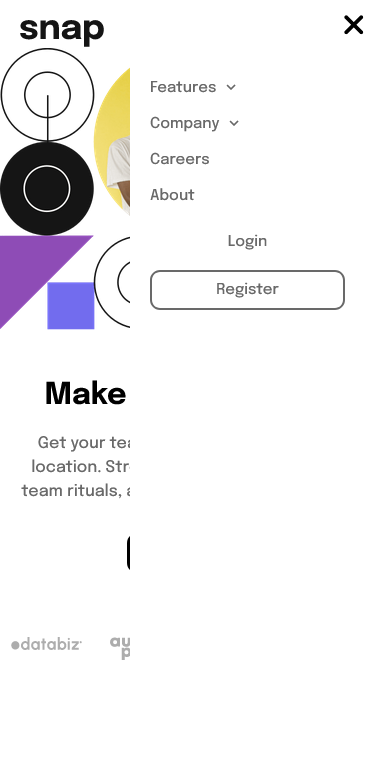

# Frontend Mentor - Intro section with dropdown navigation solution

This is a solution to the [Intro section with dropdown navigation challenge on Frontend Mentor](https://www.frontendmentor.io/challenges/intro-section-with-dropdown-navigation-ryaPetHE5). Frontend Mentor challenges help you improve your coding skills by building realistic projects. 

## Table of contents

- [Overview](#overview)
  - [The challenge](#the-challenge)
  - [Screenshot](#screenshot)
  - [Links](#links)
- [My process](#my-process)
  - [Built with](#built-with)
  - [Useful resources](#useful-resources)
- [Author](#author)

## Overview

### The challenge

Users should be able to:

- View the relevant dropdown menus on desktop and mobile when interacting with the navigation links
- View the optimal layout for the content depending on their device's screen size
- See hover states for all interactive elements on the page

### Screenshot

### Links

- Solution URL: [Solution URL](https://github.com/bobo-m/intro-section--Frontend-Mentor)
- Live Site URL: [Live Site](https://bobo-m.github.io/intro-section--Frontend-Mentor/)

## My process

### Built with

- Semantic HTML5 markup
- CSS custom properties
- Flexbox
- In File Javascript

### Useful resources

- [MDN Docs](https://developer.mozilla.org/en-US/) 
- [W3schools](https://www.w3schools.com/)

## Author

- Bob Anugrah Murmu
- Frontend Mentor - [@bobo-m](https://www.frontendmentor.io/profile/bobo-m)
